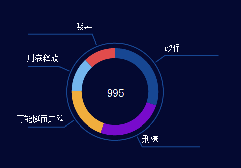

##饼图（环形图）说明文档

###1 使用说明
```
var width = Data.width
var height = Data.height

var cfg = {
  id: Data.id,
  unit: Data.unit,
  data: Data.data,
  width: width,
  height: height,
  label: {
    fontSize: '16px',
    color: '#fff',
    textAnchor: 'start',
    fontFamily: '微软雅黑'
  },
  text: {
    fontSize: '22px',
    fontColor: '#fff',
    x: '-15',
    y: '10'
  },
  tooltip: {
    fontSize: '18px',
    color: '#fff',
    fontFamily: '微软雅黑',
    padding: '10px',
    background: '#043997'
  },
  circle: {
    color: ['#174793','#e14c4c','#f1ae3d','#74b5ed','#780bcc'],
    outerRadius: width / 5.8,  //饼图的外半径 
    innerRadius: width / 5.8 - 20,  //饼图的内半径 内半径为0则中间没有空白
    pieHighColor: '#6a6b80'  //饼图高亮颜色
  },
  outCircle: {
    cx: '0',
    cy: '0',
    r: width / 5.8 +10,
    stroke: '#174793',
    strokeWidth: '2',
    fill: 'rgba(0,0,0,0)'
  },
  line: {
    fill: 'rgba(0,0,0,0)',
    strokeWidth: '2',
    stroke: '#174793'
  }
}

var result = {
    validity: [
      {
        "name": "政保",
        "value": 100
      },
      {
        "name": "吸毒",
        "value": 120
      },
      {
        "name": "可能铤而走险",
        "value": 200
      },
      {
        "name": "刑满释放",
        "value": 125
      },
      {
        "name": "刑嫌",
        "value": 250
      }
    ]
}

pie.drawPie({
    data: result.validity,  //数据
    id: "#pie", //ID
    unit: "人",  //单位
    width: "600", //画布的宽度
    height: "500" //画布的高度
})
```
###2 效果展示



###3 接口说明
####3.1 接口调用
调用方式：

```javascript
pie.drawPie({
    data: result.validity,  //数据
    id: "#pie", //ID
    unit: "人",  //单位
    width: "600", //画布的宽度
    height: "500" //画布的高度
})
```

参数说明：

- data: 数据
- data：数据
- id：ID
- unit：单位
- width：画布的宽度
- height：画布的高度

### 配置项参数说明

| 字段            | 含义        | 是否必选 | 默认值  | 备注     |      |
| ------------- | --------- | ---- | ---- | ------ | ---- |
| cfg.width     | svg宽度     | 是    | 无    | 接口传入的值 |      |
| cfg.height    | svg高度     | 是    | 无    | 接口传入的值 |      |
| cfg.id        | id        | 是    | 无    | 接口传入的值 |      |
| cfg.unit      | 单位        | 是    | 无    | 接口传入的值 |      |
| cfg.data      | 数据        | 是    | 无    | 接口传入的值 |      |
| cfg.text      | 中心文本框（总数） | 是    | 无    | 无      |      |
| cfg.tooltip   | 提示        | 是    | 无    | 无      |      |
| cfg.circle    | 环形图（饼图）   | 是    | 无    | 无      |      |
| cfg.outCircle | 饼图外环      | 是    | 无    | 无      |      |
| cfg.line      | 折线        | 是    | 无    | 无      |      |